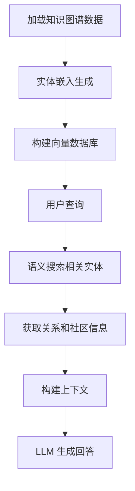
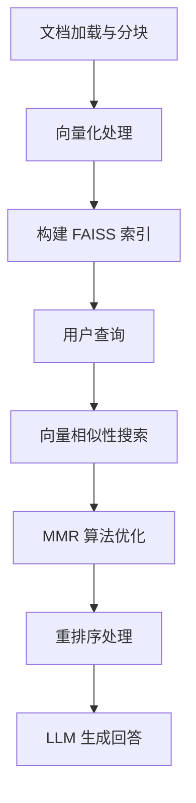

# GraphRAG vs Vector-based RAG 对比分析项目

## 📋 项目概述

本项目是一个全面的检索增强生成（RAG）系统对比分析平台，实现了两种主流的 RAG 架构：**GraphRAG** 和 **Vector-based RAG**，并提供了科学的评估框架来比较两种方法的性能和适用场景。

### 🎯 项目目标
- 实现并对比两种不同的 RAG 架构
- 提供标准化的评估方法和指标
- 为不同应用场景提供技术选型建议
- 建立可复现的实验环境

## 🏗️ 系统架构

### 核心组件
```
GraphRAG_Vector BasedRAG/
├── 📄 graph_rag.py          # GraphRAG 实现
├── 📄 vector_rag.py         # Vector-based RAG 实现  
├── 📄 evaluate_rag.py       # 评估与对比系统
├── 📄 pdf-txt.py           # PDF 转换工具
├── 📊 rag_comparison.png    # 性能对比图表
├── 📈 *_results.csv        # 评估结果数据
├── 📝 rag_suitability_analysis.txt  # 适用性分析报告
└── 📁 ragtest/             # GraphRAG 配置和数据
    ├── settings.yaml       # 配置文件
    ├── cache/             # 缓存目录
    ├── logs/              # 日志目录
    ├── prompts/           # 提示词模板
    └── ragtest/
        ├── input/         # 输入数据
        └── output/        # 输出结果
```

## 🔧 技术实现

### 1. GraphRAG 系统 (`graph_rag.py`)

**核心功能：基于知识图谱的检索增强生成**

#### 🎯 主要特性
- **知识图谱构建**：从预处理数据构建实体-关系图谱
- **语义嵌入**：使用 OpenAI text-embedding-3-small 生成实体向量
- **向量数据库**：LanceDB 存储和检索嵌入向量
- **混合检索**：结合图谱结构和语义相似性
- **智能推理**：GPT-4o-mini 基于图谱上下文生成回答

#### 🔄 工作流程


#### 💡 技术优势
- **结构化知识**：保持实体间的复杂关系
- **多层次信息**：整合实体、关系、社区报告
- **推理能力强**：适合复杂的多实体查询
- **可解释性**：提供清晰的推理路径

### 2. Vector-based RAG 系统 (`vector_rag.py`)

**核心功能：基于向量相似性的检索增强生成**

#### 🎯 主要特性
- **文档预处理**：智能分块（700字符，50字符重叠）
- **向量化索引**：OpenAI 嵌入模型转换文档为向量
- **高效检索**：FAISS 向量数据库快速相似性搜索
- **结果优化**：MMR 算法 + FlashrankRerank 重排序
- **智能问答**：GPT-4o-mini 基于检索内容生成回答

#### 🔄 工作流程


#### 💡 技术优势
- **语义理解**：不依赖关键词匹配
- **快速检索**：毫秒级向量搜索
- **精确匹配**：重排序提升相关性
- **扩展性强**：支持大规模文档集合

### 3. 评估系统 (`evaluate_rag.py`)

**核心功能：多维度 RAG 系统性能评估**

#### 📊 评估维度
- **答案正确性 (Answer Correctness)**：评估回答的准确性和完整性
- **语义相似性 (Semantic Similarity)**：测量与参考答案的语义相似度
- **答案相关性 (Answer Relevancy)**：评估回答与问题的相关程度
- **忠实度 (Faithfulness)**：检查回答对检索内容的忠实程度

#### 🔬 评估框架
- **RAGAS 框架**：业界标准的 RAG 评估工具
- **GPT-4o-mini**：用于质量评估
- **text-embedding-3-small**：用于相似性计算
- **智能分析**：GPT 模型进行场景适用性分析

#### 📈 输出结果
- **详细评估数据**：CSV 格式的量化指标
- **可视化图表**：直观的性能对比
- **适用性分析**：智能生成的场景建议

### 4. 数据预处理 (`pdf-txt.py`)

**核心功能：PDF 文档转换为纯文本**

#### 🔄 转换流程
```python
def pdf_to_txt(pdf_path, txt_path):
    """将 PDF 文件转换为 TXT 文件"""
    with pdfplumber.open(pdf_path) as pdf:
        text = ""
        for page in pdf.pages:
            text += page.extract_text() + "\n"
        with open(txt_path, "w", encoding="utf-8") as f:
            f.write(text)
```

#### 💡 转换优势
- **格式统一**：消除 PDF 格式干扰
- **公平比较**：确保两种 RAG 使用相同数据
- **处理简化**：减少解析错误和信息丢失

## 📊 性能评估结果

### 评估数据概览

基于 UnitedHealth Group 财务报告的测试结果：

#### Vector RAG 性能
- **答案正确性**：0.489 (样本1)
- **语义相似性**：0.715 (样本1)  
- **忠实度**：0.588 (样本1)

#### GraphRAG 性能
- **答案正确性**：0.197 (样本1)
- **语义相似性**：0.790 (样本1)
- **忠实度**：0.333 (样本1)

### 🎯 适用场景分析

根据评估结果和系统特性：

#### GraphRAG 适用场景
- **复杂关系查询**：需要理解多实体间复杂关系
- **知识推理**：需要基于结构化知识进行推理
- **企业分析**：财务关系、组织架构分析
- **学术研究**：需要追溯引用关系和概念联系

#### Vector RAG 适用场景
- **文档问答**：基于大量文档的直接问答
- **内容检索**：快速找到相关文档片段
- **客服系统**：基于知识库的客户支持
- **信息查找**：简单直接的信息检索需求

## 🛠️ 技术栈

### 核心依赖
- **LLM 模型**：OpenAI GPT-4o-mini
- **嵌入模型**：OpenAI text-embedding-3-small
- **向量数据库**：FAISS, LanceDB
- **评估框架**：RAGAS
- **数据处理**：pandas, pdfplumber
- **可视化**：matplotlib

### 环境配置
```yaml
# ragtest/settings.yaml 核心配置
llm:
  api_key: ${GRAPHRAG_API_KEY}
  type: openai_chat
  model: gpt-4o-mini
  
embeddings:
  api_key: ${GRAPHRAG_API_KEY}
  type: openai_embedding
  model: text-embedding-3-small
```

## 🚀 使用指南

### 1. 环境准备
```bash
# 安装依赖
pip install graphrag openai faiss-cpu lancedb ragas pdfplumber

# 设置 API Key
export OPENAI_API_KEY="your-api-key"
export GRAPHRAG_API_KEY="your-api-key"
```

### 2. 数据准备
```python
# 转换 PDF 为 TXT
from pdf_txt import pdf_to_txt
pdf_to_txt("document.pdf", "ragtest.txt")
```

### 3. 运行 GraphRAG
```python
# 执行 GraphRAG 查询
from graph_rag import run_graph_rag_query
result = run_graph_rag_query("你的问题")
```

### 4. 运行 Vector RAG
```python
# 执行 Vector RAG 查询
from vector_rag import run_vector_rag_query
result = run_vector_rag_query("你的问题")
```

### 5. 性能评估
```python
# 运行评估对比
python evaluate_rag.py
```

## 📈 项目成果

### 输出文件
- **`vector_rag_results.csv`**：Vector RAG 详细评估数据
- **`graph_rag_results.csv`**：GraphRAG 详细评估数据
- **`rag_comparison.png`**：可视化性能对比图表
- **`rag_suitability_analysis.txt`**：智能适用性分析报告

### 关键发现
1. **Vector RAG** 在直接文档问答方面表现更好
2. **GraphRAG** 在复杂关系推理方面具有优势
3. 两种方法在不同场景下各有所长
4. 评估框架提供了客观的选择依据

## 🔮 未来发展

### 技术改进方向
- **混合架构**：结合两种方法的优势
- **动态选择**：根据查询类型自动选择最优方法
- **性能优化**：提升检索速度和准确性
- **多模态支持**：扩展到图像、表格等多种数据类型

### 应用扩展
- **领域定制**：针对特定行业优化
- **实时更新**：支持知识库动态更新
- **多语言支持**：扩展到多语言环境
- **企业集成**：与现有系统深度集成

## 📝 总结

本项目提供了一个完整的 RAG 系统对比分析平台，通过科学的评估方法和详细的实现，为 RAG 技术的选择和应用提供了有价值的参考。无论是学术研究还是工业应用，都可以基于本项目的框架进行进一步的开发和优化。

---

**项目作者**：殷韵智  
**创建时间**：2025年9月  
**技术栈**：Python, OpenAI, GraphRAG, FAISS, LanceDB, RAGAS
